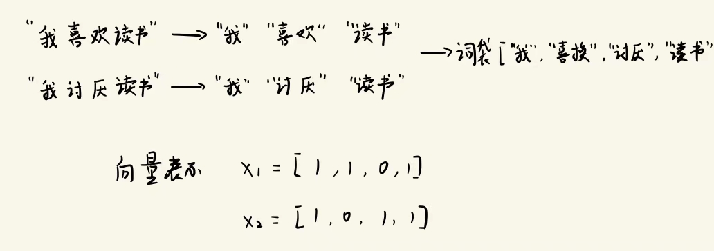

# 任务1

# 1. 赛题信息

* 任务：

  * 任务1 

    输入：论文标题、作者信息、摘要、关键词。输出：论文是否属于医学领域的文献（二分类问题）
  * 任务2

    输入：论文标题、作者信息、摘要。输出：论文关键词
* 评价指标：

  * 任务1

    f1分数
  * 任务2

    准确率
* 数据体量

  * 训练集：6000行数据
  * 测试集：2358行数据

# 2. Baseline

## 2.1 任务1

### 2.1.1 核心思路

* 通过 BOW（词袋）模型或 TF-IDF（词频-逆文档频率）将文本转化为向量表示。
* 通过逻辑回归、支持向量机、决策树、随机森林等模型进行训练。

### 2.1.2 BOW（词袋）

BOW 的核心思想是**给文档准备一个词汇袋，里面装着文档中的所有词汇（已去重）**。将词袋看作一个 python 列表，可以将单独的句子用相同长度的向量表示。如果句子包含某个词，则**向量中对应这个词的位置的值取1，否则取0**。

优点：简单。

缺点：对于词汇的顺序、所在语境、词法等信息未考虑，意思完全不同的两句话可能有相似的向量表示。

参考：[(54条消息) 词向量之词袋模型(BOW)详解_bow词袋模型_Elenstone的博客-CSDN博客](https://blog.csdn.net/Elenstone/article/details/105134863)

### 2.1.2 TF-IDF（词频-逆文档频率）

TF-IDF 的核心思想是**统计文档中的词频（TF）和利用语料库统计逆文档频率（IDF）**，词频代表这个**词出现的频率**，逆文档频率代表这个**词出现的常见程度**，越常见值越小，两者相乘的值越大说明这个词在文档中的重要性越大。

* TF 计算

  $$
  标准化词频（TF） = \frac{某个词在文章中出现的次数}{文章总次数}
  $$
* IDF 计算

  $$
  \text{逆文档频率}(\mathrm{IDF})=\log(\frac{\text{语料库的文档总数}}{\text{包含该词的文档数}+1})
  $$

优点：简单。

缺点：词频来表示词的重要程度有可能不全面，为。考虑词的顺序等信息。

参考：[机器学习：生动理解TF-IDF算法 - 知乎 (zhihu.com)](https://zhuanlan.zhihu.com/p/31197209)
