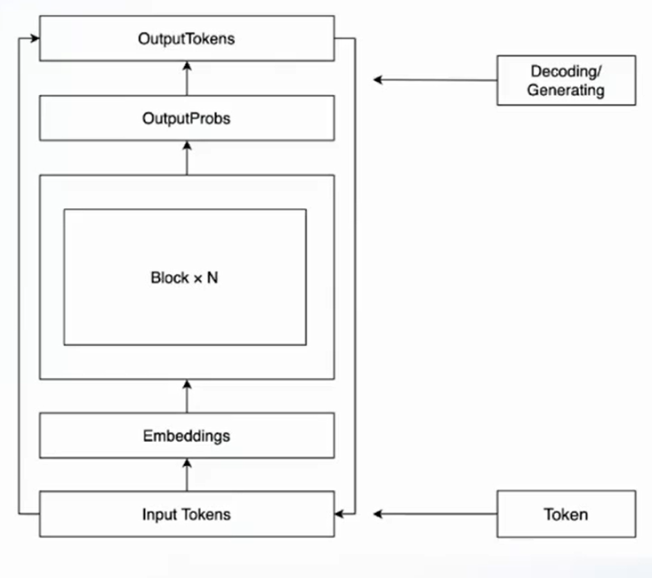
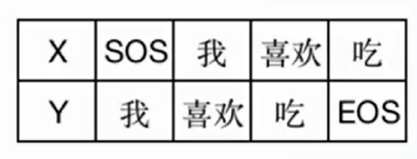
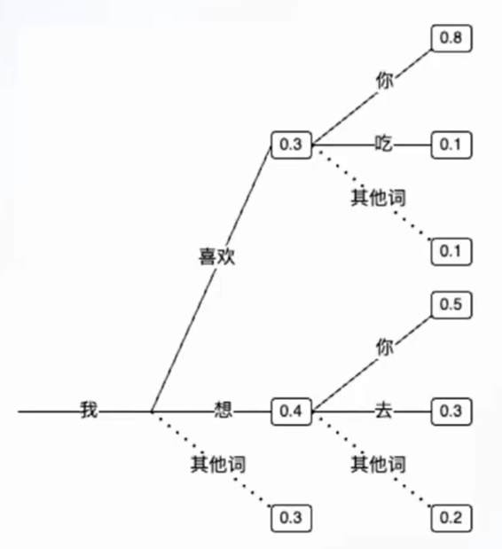

# 任务3

> 利用 ChatGLM2-6B 大模型微调进行文本二分类任务

# 1. 大语言模型（LLM）基本原理

## 1.1 基本工作原理



## 1.2 训练原理



本质上是学习一种，词与词，句子与句子之间的一种映射关系。

## 1.3 生成原理

​​

# 2. 微调中遇到的问题

## 2.1 下载模型文件

问题：由于模型文件过大，导致 gitclone 时一直卡住

解决方案：一个一个文件手动下载，然后整合到一个文件夹里

## 2.2 模型文件过大

由于模型文件过大，在 kaggle notebook 中无法加载，且根据介绍，微调后的模型在训练集上的分类准确率为0.985，与机器学习方法交叉验证得到的准确率差别不大，故不采用，将问题中心放在解决任务2关键词提取上。

# 关于任务2的尝试

## 1.1 bert-keyword-extractor（huggingface）

地址：[yanekyuk/bert-keyword-extractor · Hugging Face](https://huggingface.co/yanekyuk/bert-keyword-extractor)

输入：trian['abstract'].iloc[0]

标签：accessibility technology; multimodal interaction; auditory interface; touch interface; vision impairment

输出：

```json
[{'entity_group': 'KEY',
  'score': 0.5904310345649719,
  'word': 'visually',
  'start': 64,
  'end': 72},
 {'entity_group': 'KEY',
  'score': 0.5579718351364136,
  'word': '##modal',
  'start': 385,
  'end': 390}]
```

结论：效果不佳

## 1.2 pke包

pke 是一个专门用于关键词提取的 python 包，其中包含了常见的基于统计和基于图结构的关键词提取算法，且接口统一，便于调用，github 官方地址：[boudinfl/pke: Python Keyphrase Extraction module (github.com)](https://github.com/boudinfl/pke)

pke 包含算法：

* Unsupervised models

  * Statistical models

    * FirstPhrases
    * TfIdf
    * KPMiner [(El-Beltagy and Rafea, 2010)](http://www.aclweb.org/anthology/S10-1041.pdf)
    * YAKE [(Campos et al., 2020)](https://doi.org/10.1016/j.ins.2019.09.013)
  * Graph-based models

    * TextRank [(Mihalcea and Tarau, 2004)](http://www.aclweb.org/anthology/W04-3252.pdf)
    * SingleRank [(Wan and Xiao, 2008)](http://www.aclweb.org/anthology/C08-1122.pdf)
    * TopicRank [(Bougouin et al., 2013)](http://aclweb.org/anthology/I13-1062.pdf)
    * TopicalPageRank [(Sterckx et al., 2015)](http://users.intec.ugent.be/cdvelder/papers/2015/sterckx2015wwwb.pdf)
    * PositionRank [(Florescu and Caragea, 2017)](http://www.aclweb.org/anthology/P17-1102.pdf)
    * MultipartiteRank [(Boudin, 2018)](https://arxiv.org/abs/1803.08721)
* Supervised models

  * Feature-based models

    * Kea [(Witten et al., 2005)](https://www.cs.waikato.ac.nz/ml/publications/2005/chap_Witten-et-al_Windows.pdf)

将训练集前 50 个样本作为输入，得到的准确率如下表所示：

|算法|acc|
| :----------------: | :---------------------------------: |
|FirstPhrases|0.24877056277056273|
|TfIdf|**0.3276038961038962**|
|KPMiner|​​0.11900865800865804​|
|YAKE|​​0.3090714285714286​|
|TextRank|​​0.25910389610389606​|
|SingleRank|​​​​0.26393722943722936​​​|
|TopicRank|​​0.2154523809523809​|
|TopicalPageRank|​​0.2549372294372294​|
|PositionRank|​​0.2704372294372294​|
|MultipartiteRank|​​0.26660389610389607​|

可以看出，在训练集上的简单测试中，TfIdf 的测试效果最佳。

## 1.3 SGRank

将训练集前 50 个样本作为输入，得到的准确率如下表所示：

|算法|acc|
| :------: | :------------------------: |
|SGRank|​​0.2108896103896104​|

## 1.4 keybert

将训练集前 50 个样本作为输入，得到的准确率如下表所示：

|算法|acc|
| :-------: | :---------------------------: |
|keybert|​​0.20753246753246757​<br />|

# 3. 最终方案

采用 bert 进行文本分类，TFIDF 进行文本关键词提取。

# 4. 总结

## 4.1 可以改进的方向：

* 采用监督算法进行文本关键词提取，可以尝试把关键词提取看作一个序列标注任务、机器翻译任务或者文本生成任务，这几种类型的算法由于时间和提交次数关系没用上，主要尝试的是无监督算法。
* 利用大模型微调进行文本分类和关键词提取，由于硬件条件限制，没有尝试大模型的微调。
