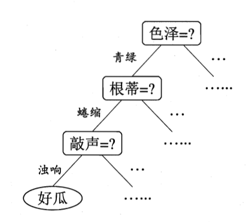
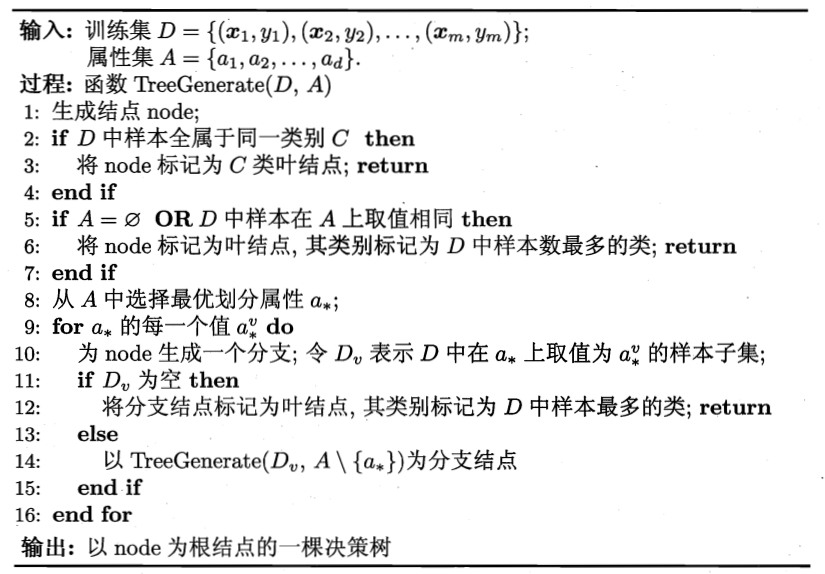
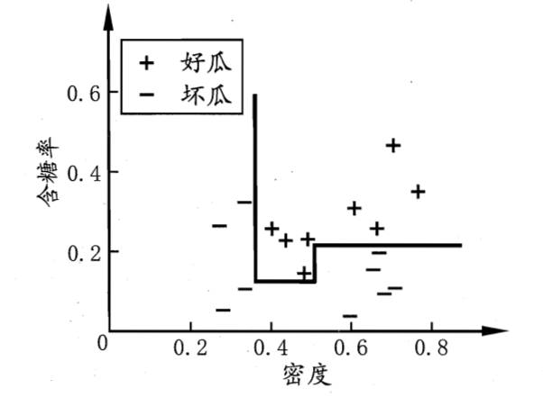
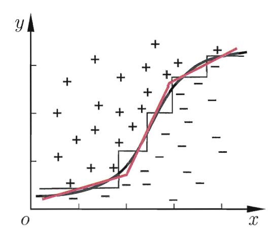

# 第四章

决策树是一种根据树结构来对样本进行分类的算法，它的核心思想是将对样本分类的决策转化为一个个**子决策**。

​​

# 1. 基本流程

​​

决策树的生成是一个递归过程，关键在于**划分的选取**。

# 2. 划分选择

选择属性进行划分时的一个基本原则是**尽可能使得划分后的节点中样本属于同一类别**。可以假设所有的叶子结点包含的样本都属于同一类别（实际上是一种最理想的情况，但此时的泛化性可能很差），那么我们就可以仅通过对样本各个特征的值进行判断就可以判断样本所属的类别。

## 2.1 选择方法

### 2.1.1 信息增益

给定当前样本集合 $D$，假设其中第 $k$ 类样本占比为 $p_k$，则当前样本集合 $D$ 的信息熵可以用下面的公式计算：

$$
\operatorname{Ent}(D)=-\sum_{k=1}^{|\mathcal{Y}|}p_k\log_2p_k
$$

信息熵代表了不确定度，而我们的最理想目标（先暂时不考虑泛化性问题）是将不确定度降低为0，即通过一个样本的每一个特征的取值即可判断样本所属的类别，所以再选择用于划分的特征时，我们要**选择一个能够使得划分后样本集合的信息熵得到最大程度降低的特征**。

假设离散特征 $a$ 的取值范围为 $\{a^{1},a^{2},\ldots,a^{V}\}$，其中第 $v$ 个取值为 $a^v$，当前样本集合中特征 $a$ 的取值为 $a^v$ 的样本集合为 $D^v$，则可以定义出选择特征 $a$ 作为划分特征时的信息增益：

$$
\operatorname{Gain}(D,a)=\operatorname{Ent}(D)-\sum_{v=1}^V\frac{|D^v|}{|D|}\operatorname{Ent}(D^v)
$$

信息增益，顾名思义就是信息的增加量，即我们划分后获得的信息（减少的对样本类别的不确定度）。所以在划分节点时，**选择对应信息增益最大的特征进行划分**，ID3 决策树算法就采用这种方式进行划分。

### 2.1.2 增益率

在 ID3 算法中，信息增益准则对可取值数量多的特征有偏好，为了避免这种偏好的影响，C4.5 算法采取增益率准则：

$$
\mathrm{Gain}\_\text{ratio}(D,a)=\frac{\mathrm{Gain}(D,a)}{\mathrm{IV}(a)}
$$

其中 $IV(a)$ 为特征 $a$ 的固有值（intrinsic value）：

$$
\mathrm{IV}(a)=-\sum_{v=1}^V\frac{|D^v|}{|D|}\log_2\frac{|D^v|}{|D|}
$$

一般而言，对于可取值越多的特征，其固有值也越大。

### 2.1.3 基尼指数

对于当前样本集合 $D$ 来说，其基尼值为：

$$
\begin{aligned}\mathrm{Gini}(D)=&\sum_{k=1}^{|\mathcal{Y}|}\sum_{k^{\prime}\neq k}p_kp_{k^{\prime}}\\=&1-\sum_{k=1}^{|\mathcal{Y}|}p_k^2.\end{aligned}
$$

属性 $a$ 的基尼指数为：

$$
\mathrm{Gini}\_\mathrm{index}(D,a)=\sum_{v=1}^V\frac{|D^v|}{|D|}\mathrm{Gini}(D^v)
$$

CART 算法以基尼指数作为划分选择的标准。

# 3. 剪枝（pruning）处理

## 3.1 剪枝的作用

剪枝的作用在于**降低模型过拟合的风险，提高模型的泛化性能**，其核心在于**主动抛弃一些子树**，避免模型对训练集进行过分学习。

## 3.2 预剪枝（prepruning）

预剪枝是在划分节点时做出判断是否要划分，分别在验证集上测试划分和不划分两种情况模型的性能，根据性能好坏来判断是否需要划分。

* 优点：

  * 降低模型过拟合风险
  * 减小决策树构建的时间开销
* 缺点：

  * 没有考虑虽然当前划分会造成模型泛化性能下降，但后面的划分显著提高模型泛化性能的可能性。
  * 容易造成欠拟合。

## 3.3 后剪枝（post-pruning）

后剪枝是在建立好完整的决策树之后自下而上逐个将子树替换成叶子节点，分别在验证集上测试划分和不划分两种情况模型的性能，根据性能好坏来判断是否需要划分。

* 优点：

  * 泛化性能较好的同时不易欠拟合
* 缺点：

  * 时间开销大幅提高

# 4. 连续与缺失值

## 4.1 连续值处理

由于连续特征有无数个取值，所以无法直接利用，我们采用连续值离散化技术进行处理，比较常见的一种是二分法（bi-partition）。

给定数据集 $D$ 和连续特征 $a$，假设 $a$ 在数据集上有 $n$ 个取值，分别为 $\{a^1,a^2,\ldots,a^n\}$（由小到大排列）。在 $a^i$ 和 $a^{i+1}$ 之间选取一个划分点 $t$，将数据集划分为 $D^{t-}$ 和 $D^{t+}$，$D^{t-}$ 包含特征 $a$ 取值小于 $t$ 的样本，$D^{t+}$ 包含特征 $a$ 取值大于 $t$ 的样本。我们可以观察到 $t$ 取 $a^i$ 和 $a^{i+1}$ 之间的任何值对划分的结果不会造成改变，为方便起见，我们取 $t = \frac{a^i+a^{i+1}}{2}$。对于特征 $a$，我们就可以得到 $n-1$ 个划分点组成的划分点集：

$$
T_a=\left\{\frac{a^i+a^{i+1}}{2}\mid1\leqslant i\leqslant n-1\right\}
$$

则信息增益可以如下面这样计算：

$$
\begin{aligned}
\operatorname{Gain}(D,a)& =\max_{t\in T_a}\mathrm{~Gain}(D,a,t)  \\
&=\max_{t\in T_a}\mathrm{Ent}(D)-\sum_{\lambda\in\{-,+\}}\frac{|D_t^\lambda|}{|D|}\mathrm{Ent}(D_t^\lambda)
\end{aligned}
$$

## 4.2 缺失值处理

对于缺失值的处理我们主要考虑两种情况：

* 划分之前，特征值缺失，如何选择划分特征
* 确定划分特征之后，某样本的该特征确实，如何确定该样本的划分

对于第一种情况，我们首先给定数据集 $D$ 和特征 $a$，假设 $\tilde{D}$ 表示数据集中特征 $a$ 没有缺失的样本子集，我们对每一个样本赋予一个权重 $k$，并作如下定义：

$$
\begin{aligned}\rho=&\frac{\sum_{\boldsymbol{x}\in\tilde{D}}w_{\boldsymbol{x}}}{\sum_{\boldsymbol{x}\in D}w_{\boldsymbol{x}}},\\\tilde{p}_k=&\frac{\sum_{\boldsymbol{x}\in\tilde{D}_k}w_{\boldsymbol{x}}}{\sum_{\boldsymbol{x}\in\tilde{D}}w_{\boldsymbol{x}}}&(1\leqslant k\leqslant|\mathcal{Y}|),\\\tilde{r}_v=&\frac{\sum_{\boldsymbol{x}\in\tilde{D}^v}w_{\boldsymbol{x}}}{\sum_{\boldsymbol{x}\in\tilde{D}}w_{\boldsymbol{x}}}&(1\leqslant v\leqslant V).\end{aligned}
$$

根据上面的公式，我们可以看到 $\rho$ 代表了特征 $a$ 没有缺失的样本在数据集中的比例，$\tilde{p}_k$ 代表了每一类别样本在特征 $a$ 没有缺失的样本子集中的比例，$\tilde{r}_v$ 代表了特征 $a$ 每一种取值样本在特征 $a$ 没有缺失的样本子集中的比例。进而可以将信息增益的公式推广为下面的式子：

$$
\begin{aligned}
\operatorname{Gain}(D,a)& =\rho\times\mathrm{Gain}(\tilde{D},a)  \\
&=\rho\times\left(\operatorname{Ent}\left(\tilde{D}\right)-\sum_{v=1}^V\tilde{r}_v\operatorname{Ent}\left(\tilde{D}^v\right)\right)
\end{aligned}
$$

对于第二种情况，有下列两种情形：

* 特征 $a$ 未缺失的样本：直接按照其取值进行划分
* 特征 $a$ 缺失的样本：按照 $\tilde{r}_{v}\cdot w_{\boldsymbol{x}}$ 的权重划分到每一个子节点中

# 5. 多变量决策树

在单变量决策树中，决策树对应的分类边界总是与轴平行的（因为划分时特征值相同的样本被划分到同一个子节点，此时的分类边界就与这一个维度的轴平行），如下图所示：

​​

但有时这种单变量决策树会导致时间开销很大，比如下面这种情况：

​​

此时采用多变量决策树可以**构造倾斜的决策边界，简化决策树模型**。此时不再是针对每一个特征进行划分，而是**考虑特征的线性组合**。

‍
