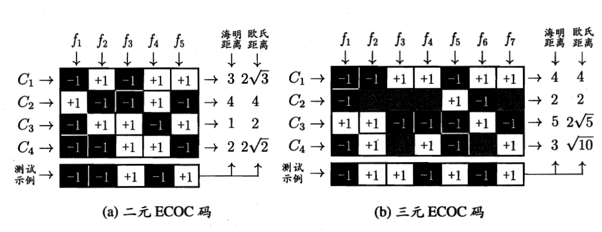

# 第三章

# 1. 线性回归

## 1.1 一元线性回归

一元线性回归中的“一元”是指**特征向量 ​**​$x_i$**​**​ 的维度只有一维**，即每一个样本只有一个特征。

### 1.1.1 模型

$$
f(x_i)=wx_i+b
$$

### 1.1.2 目标

$$
\begin{aligned}
(w^*,b^*)& =\arg\min_{(w,b)}\sum_{i=1}^m\left(f\left(x_i\right)-y_i\right)^2  \\
&=\arg\min_{(w,b)}\sum_{i=1}^m(y_i-wx_i-b)^2
\end{aligned}
$$

### 1.1.3 参数估计

由于采用的是**均方误差**来衡量线性回归模型的性能，所以这里的参数估计是线性回归的**最小二乘法参数估计**，具体而言就是求 $\omega$ 和 $b$ 使得 $E_{(\omega,b)}$ 最小的过程。

$$
E_{(w,b)}=\sum_{i=1}^m(y_i-wx_i-b)^2
$$

将 $E_{(\omega,b)}$ 对 $\omega$ 和 $b$ 分别求偏导得：

$$
\begin{aligned}
&\frac{\partial E_{(w,b)}}{\partial w} =2\left(w\sum_{i=1}^mx_i^2-\sum_{i=1}^m\left(y_i-b\right)x_i\right),  \\
&\frac{\partial E_{(w,b)}}{\partial b} =2\left(mb-\sum_{i=1}^m\left(y_i-wx_i\right)\right)
\end{aligned}
$$

分别令上面的两个式子 = 0，则可以求得 $\omega$ 和 $b$ 最优解，具体而言联立方程组求解即可。

$$
w=\frac{\sum_{i=1}^my_i(x_i-\bar{x})}{\sum_{i=1}^mx_i^2-\frac1m\left(\sum_{i=1}^mx_i\right)^2},
$$

$$
b=\frac1m\sum_{i=1}^m(y_i-wx_i)
$$

## 1.2 多元线性回归

多元线性回归中的“多元”是指**特征向量 ​**​$x_i$**​**​ 的维度有多维**，即每一个样本只有多个特征。

### 1.1.1 模型

$$
f(\boldsymbol{x}_i)=\boldsymbol{w}^\mathrm{T}\boldsymbol{x}_i+b
$$

由于特征向量 $\boldsymbol{x}_i$ 含有多个特征，则利用向量表示权重、输入、输出：

$$
f(\boldsymbol{x})=\boldsymbol{w}^\mathrm{T}\boldsymbol{x}
$$

### 1.1.2 目标

$$
{\boldsymbol{w}}^*=\underset{{\boldsymbol{w}}}{\operatorname*{\arg\min}}\left(\boldsymbol{y}-\mathbf{X}^T{\boldsymbol{w}}\right)^\mathrm{T}\left(\boldsymbol{y}-\mathbf{X}^T{\boldsymbol{w}}\right)
$$

​​

### 1.1.3 参数估计

令 $E_{{\boldsymbol{w}}}=\left(\boldsymbol{y}-\mathbf{X}^T{\boldsymbol{w}}\right)^\mathrm{T}\left(\boldsymbol{y}-\mathbf{X}^T{\boldsymbol{w}}\right)$，对 $\boldsymbol{\omega}$ 求偏导得：

$$
\frac{\partial E_{{\boldsymbol{w}}}}{\partial{\boldsymbol{w}}}=2\mathbf{ X}\left(\mathbf{X}^T{\boldsymbol{w}}-\boldsymbol{y}\right)
$$

求得 $\boldsymbol{\omega}$ 的闭式解：

$$
\boldsymbol{w}^*=(\boldsymbol{X}\boldsymbol{X}^T)^{-1}\boldsymbol{X}\boldsymbol{y}
$$

## 1.2 广义线性回归

$$
y=g^{-1}(\boldsymbol{w^\mathrm{T}}\boldsymbol{x}+b)
$$

广义线性归回就是指对线性回归基本模型的函数变换。

# 2. 对数几率回归（逻辑回归）

一般的回归模型只用于解决回归问题，但对数几率回归通过广义线性回归中提到的函数变换可以将回归得到的预测**连续值转换为类别**，虽然叫回归，但针对的是分类任务。

这样的函数变换有很多种，对数几率回归采用的是对数几率函数（logistic function）：

$$
y=\frac1{1+e^{-z}}
$$

​​

> 虽然单位阶跃函数在将连续值转换为类别上有很好的性质，但它**不是连续函数，不利于参数迭代优化**，而对数几率函数则具有连续性，且容易求导。

## 2.1 对数几率：

$$
\ln\frac y{1-y}
$$

对数几率的分子是后验概率 $P(y=1|x)$，代表着预测为正类的概率，而分母则代表预测为负类的概率，两者相比表示了预测为正类和负类的相对大小，通过这个相对大小判断为正类还是负类。将对数几率函数代入后可得：

$$
\ln\frac{p(y=1\mid\boldsymbol{x})}{p(y=0\mid\boldsymbol{x})}=\boldsymbol{w}^\mathrm{T}\boldsymbol{x}+b
$$

## 2.2 参数估计

对数几率回归采用**极大似然法（maximum likelihood method）**对参数进行估计，如下为对数似然函数：

$$
\ell(\boldsymbol{w})=\sum_{i=1}^m\ln p(y_i\mid\boldsymbol{x}_i;\boldsymbol{w})
$$

由于后验概率的公式如下：

$$
p(y_i\mid\boldsymbol{x}_i;\boldsymbol{w})=y_ip_1(\hat{\boldsymbol{x}}_i;\boldsymbol{w})+(1-y_i)p_0(\hat{\boldsymbol{x}}_i;\boldsymbol{w})
$$

代入对数似然函数中，将最大化转换为如下式的最小化：(左侧符号为简单起见未做更改)

$$
\ell(\boldsymbol{w})=\sum_{i=1}^m\left(-y_i\boldsymbol{w}^\mathrm{T}\hat{\boldsymbol{x}}_i+\ln\left(1+e^{\boldsymbol{w}^\mathrm{T}\hat{\boldsymbol{x}}_i}\right)\right)
$$

可以用梯度下降法或牛顿法等优化方法进行参数迭代。

# 3. 线性判别分析（Linear Discriminant Analysis）

## 3.1 模型

### 3.1.1 核心思想

​​

将所有样本点投影到同一直线上，使得**相同类别样本的投影点距离尽可能近**，**不同类别样本的投影中心点距离尽可能远**，根据新样本的投影来判断其所属类别。

### 3.1.2 目标

给定数据集 $D=\{(\boldsymbol{x}_i,y_i)\}_{i=1}^m,y_i\in\{0,1\}$，首先进行如下符号定义：

* $X_i$：第 $i$ 类样本集合
* $\mu_i$：第 $i$ 类样本均值向量
* $\Sigma_i$：第 $i$ 类样本协方差矩阵
* $\omega$：投影到的直线

则两类样本的中心点投影与协方差分别为：$\boldsymbol{w}^\mathrm{T}\boldsymbol{\mu}_0、\boldsymbol{w}^\mathrm{T}\boldsymbol{\mu}_1、\boldsymbol{w}^\mathrm{T}\Sigma_0\boldsymbol{w}\text{ 、 }\boldsymbol{w}^\mathrm{T}\Sigma_1\boldsymbol{w}$

按照 LDA 的思想，我们要实现的目标有两个：

* 两类样本中心投影点尽可能远，下面是两类样本中心投影点的距离为：

  $$
  \|\boldsymbol{w^\mathrm{T}}\boldsymbol{\mu_0}-\boldsymbol{w^\mathrm{T}}\boldsymbol{\mu_1}\|_2^2
  $$
* 同类样本点的投影点尽可能近，即让两类样本的协方差之和尽可能小：

  $$
  \boldsymbol{w^\mathrm{T}}\boldsymbol{\Sigma_0w}+\boldsymbol{w^\mathrm{T}}\boldsymbol{\Sigma_1w}
  $$

则优化目标为：

$$
\begin{aligned}
\text{J}& =\frac{\|\boldsymbol{w^\mathrm{T}}\boldsymbol{\mu}_0-\boldsymbol{w^\mathrm{T}}\boldsymbol{\mu}_1\|_2^2}{\boldsymbol{w^\mathrm{T}}\boldsymbol{\Sigma}_0\boldsymbol{w}+\boldsymbol{w^\mathrm{T}}\boldsymbol{\Sigma}_1\boldsymbol{w}}  \\
&=\frac{\boldsymbol{w}^\mathrm{T}(\boldsymbol{\mu}_0-\boldsymbol{\mu}_1)(\boldsymbol{\mu}_0-\boldsymbol{\mu}_1)^\mathrm{T}\boldsymbol{w}}{\boldsymbol{w}^\mathrm{T}(\boldsymbol{\Sigma}_0+\boldsymbol{\Sigma}_1)\boldsymbol{w}}
\end{aligned}
$$

然后我们定义类内散度矩阵与类间散度矩阵，简化目标的表达式：

* 类内散度矩阵（within class scatter matrix）：

  $$
  \begin{aligned}
  \mathbf{S}_{w}& =\boldsymbol{\Sigma}_0+\boldsymbol{\Sigma}_1  \\
  &=\sum_{\boldsymbol{x}\in X_0}\left(\boldsymbol{x}-\boldsymbol{\mu}_0\right)\left(\boldsymbol{x}-\boldsymbol{\mu}_0\right)^\mathrm{T}+\sum_{\boldsymbol{x}\in X_1}\left(\boldsymbol{x}-\boldsymbol{\mu}_1\right)\left(\boldsymbol{x}-\boldsymbol{\mu}_1\right)^\mathrm{T}
  \end{aligned}
  $$
* 类间散度矩阵（between class scatter matrix）：

  $$
  \mathbf{S}_b=\left(\boldsymbol{\mu}_0-\boldsymbol{\mu}_1\right)\left(\boldsymbol{\mu}_0-\boldsymbol{\mu}_1\right)^\mathrm{T}
  $$

> ps：这里的散度不是指的微积分中的散度（divergence），散度/散布矩阵（scatter matrix）是**对协方差矩阵的一种估计**（参考：https://en.wikipedia.org/wiki/Scatter_matrix）

则目标 $J$ 可以简化为由散度矩阵和 $\omega$ 组成的表达式：

$$
J=\frac{\boldsymbol{w}^\mathrm{T}\mathbf{S}_b\boldsymbol{w}}{\boldsymbol{w}^\mathrm{T}\mathbf{S}_w\boldsymbol{w}}
$$

现在我们已经得到了简化过的优化目标 $J$，我们的目标就是最大化 $J$。经过观察我们可以发现， $J$ 的分子和分母都是 $\omega$ 的二次项，则 $\omega$ 的长度在计算 $J$ 的过程中不起作用（分子分母相抵消）。则我们可以对 $J$ 的表达形式进一步化简：

$$
\begin{aligned}\min_{\boldsymbol{w}.}&-\boldsymbol{w}^\mathrm{T}\mathbf{S}_b\boldsymbol{w}\\\mathrm{s.t.}&\boldsymbol{w}^\mathrm{T}\mathbf{S}_w\boldsymbol{w}=1\end{aligned}
$$

通过拉格朗日乘子法，将问题转化为：

$$
\mathbf{S}_b\boldsymbol{w}=\lambda\mathbf{S}_w\boldsymbol{w}
$$

> ps：拉格朗日乘子法是一种求多元函数在约束条件下的极值的优化方法，核心是将 $d$ 个变量和 $k$ 个约束条件的最优化问题**转化为 ​**​$d+k$**​**​ 个变量的无约束优化问题**。（参考：西瓜书附录B.1）

由于类间散度矩阵 $S_b$ 代表着两类样本中心投影点的距离，所以它的方向应该始终与两个样本中心点的连线相同，即 $\mu_0 - \mu_1$，则可以将 $S_b\omega$ 表示为 $\mathbf{S}_b\boldsymbol{w}=\lambda(\boldsymbol{\mu}_0-\boldsymbol{\mu}_1)$，则 $\omega$ 可以按照下面的方法求解：

$$
\boldsymbol{w}=\mathbf{S}_w^{-1}(\boldsymbol{\mu}_0-\boldsymbol{\mu}_1)
$$

# 4. 多分类问题

## 4.1 基本原则

多分类问题通常不能直接通过一个分类器直接解决，往往是将**多分类问题拆解为多个二分类问题**，训练多个二分类器，然后**将多个二分类器的结果集成**得到最终的分类结果。

## 4.2 多分类拆解为二分类问题的方式

首先我们给定数据集 $D=\{(\boldsymbol{x}_1,y_1),(\boldsymbol{x}_2,y_2),\ldots,(\boldsymbol{x}_m,y_m)\},y_i\in\{C_1,C_2,\ldots,C_N\}$，一共有 $N$ 个类别

### 4.2.1 一对一（OVO）

在 $N$ 个类别中选择两个类别，利用这两个类别的数据训练一个二分类器，一共可以训练 $N(N-1)/2$**​**​ 个**分类器，测试样本输入到这些分类器中，然后对得到的分类结果进行投票。

### 4.2.1 一对其余（OVR）

在 $N$ 个类别中选择一个类别，利用这个类别和其他所有类别的数据训练一个二分类器，一共可以训练 $N$**​**​ 个**分类器，测试样本输入到这些分类器中，若只有一个分类器预测为正类，则结果为该分类器正类；若多个分类器预测为正类，则通过分类器置信度进行选择。

### 4.2.1 多对多（MVM）

常用纠错输出码（ECOC）技术，主要分为两步：

* 编码：对数据集进行 $M$ 次划分，训练 $M$ 个分类器。
* 解码：将测试样本输入到这 $M$ 个分类器，得到预测结果向量，通过预测结果向量与各类别不同分类器划分结果向量之间的距离比较选择最终的分类结果。

​​

# 5. 类别不平衡问题

在实际的数据中，很有可能出现类别不平衡的问题，即正例和反例的数据量相差过大。这样会导致分类器直接固定返回某一类别，而遇到新的样本时完全无法进行正确判断。为了解决这个问题，可以采取过采样、欠采样、阈值移动这三种方法。

我们首先假设我们的问题是二分类，在数据集中，正类数量 << 负类数量。

## 5.1 过采样

将数量少的类进行过采样，使得其数量与数量多的类相当，代表算法为 $SMOTE$。

## 5.2 欠采样

将数量多的类进行欠采样，使得其数量与数量少的类相当，代表算法为 $EasyEnsembel$。

> ps：过采样不能简单地重复数据，欠采样不能简单地随机删除数据。

## 5.3 阈值移动

以线性分类为例，在线性分类中，我们要判断得到的结果是否大于 0.5，若大于 0.5 则判为正类，否则判为负类，但是 0.5 这个阈值标准是在类别均衡的情况下得来的，它的意义是 $\frac{y}{1-y}>1$，代表样本为正类的概率大于样本为负类的概率。但在类别不平衡问题中，由于数据本身的不平衡性，导致样本为正类和负类的概率本来就有较大差异，而我们可以通过调整阈值来抵抗这种数据差异对预测结果带来的干扰，具体做法如下：

$$
\frac{y^{\prime}}{1-y^{\prime}}=\frac y{1-y}\times\frac{m^-}{m^+}
$$
