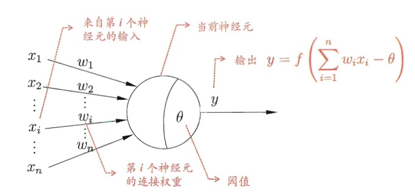
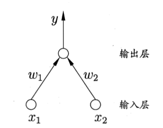
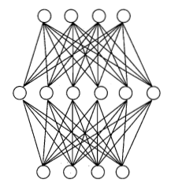
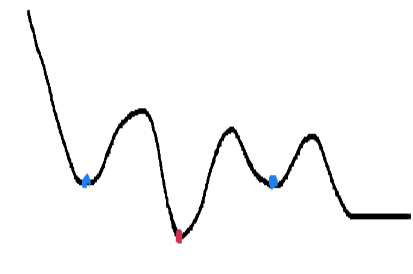

# 1. 神经元模型

神经元原本是一个生物学概念，神经元细胞在我们的身体里起到了接收、处理、传递信息的作用。在人工神经网络中，人们也采用相似的结构。人工神经元模型示意图如下：

人工神经元模型可以接收输入的信息，处理信息，然后输出。具体而言是接收前一层神经元的输出与相关权重作为当前神经元的输入，然后对输入信息进行处理，接着通过**激活函数（activation function）**输出信息。常见的激活函数有 sigmoid、ReLU、tan 等等，其作用是<u>在模型中加入非线性因素，增强模型能力</u>。

# 2. 感知机与多层网络

总体而言，**感知机（perceptron）**由两层神经元组成，包含一个输入层和一个输出层，而**多层网络**往往包含**隐藏层（hidden layer），**即由三层及以上的神经元组成。

感知机的结构如下图所示：

在上面的结构示意图中，为方便起见输入层只包含了两个神经元，也可以包含更多的神经元。其中的 $w_1,w_2$ 是层与层之间的权重，表示了输入层的各神经元对当前神经元的影响，可以在通过学习而不断调整。由两层神经元的感知机进而可以推广到多层网络，其结构如下：

在上面的示意图中，多层网络只包含了一层隐藏神经元，但根据问题的需要，可以加入更多隐藏层。通过观察我们可以发现，在上图中，同一层的神经元之间并没有连接关系，同时神经元没有跨层之间的连接关系，这样的神经网络又可以称为**前馈神经网络（feedforward neural network）**。

> ps：这里的前馈指的是<u>网络不存在环或回路的结构，并不是指信息只能向前传播。</u>

# 3. 反向传播算法

**反向传播（back propagation）**算法是一种用于训练神经网络的算法，应用十分广泛。它既可以用于训练前馈神经网络，也可以用于训练**循环神经网络（recurrent neural network**）等其他网络，利用反向传播算法训练的前馈神经网络也被称为**​ BP 神经网络**。下面以一个较为具体的例子来说明反向传播算法的具体含义和操作流程。

首先假设我们现在定义了一个神经网络，共有 $L$ 层，在第 $l$ 层有 $M_l$ 个神经元，第 $l$ 层的激活函数为 $f_l(\cdot)$，第 $l-1$ 层到第 $l$ 层的权重矩阵为 $\bm{W}^{(l)}\in\mathbb{R}^{M_l\times M_{l-1}}$，第 $l-1$ 层到第 $l$ 层的偏置为 $\bm{b}^{(l)}\in\mathbb{R}^{M_l}$，第 $l$ 层的输入为 $\bm{z}^{(l)}\in\mathbb{R}^{M_l}$，输出为 $\bm{a}^{(l)}\in\mathbb{R}^{M_l}$，那么第 $l$ 层的信息输入、处理、输出过程可以由下面的公式表示：

$$
\begin{aligned}
&\bm{z}^{(l)} =\boldsymbol{W}^{(l)}\boldsymbol{a}^{(l-1)}+\boldsymbol{b}^{(l)},  \\
&\bm{a}^{(l)} =f_l(\bm{z}^{(l)}). 
\end{aligned}
$$

要训练神经网络，就需要先根据问题定义其损失函数，然后进行参数学习，可以采用梯度下降法、牛顿法等。给定样本 $(\bm{x},\bm{y})$，假设模型得到的输出为 $\bm{\hat{y}}$，损失函数为 $\mathcal{L}({\bm{y}, \bm{\hat{y}}})$，需要学习的参数为权重 $\bm{W}$ 以及偏置 $\bm{b}$。若我们采用梯度下降法来进行参数学习，则需要求得损失函数对于参数的偏导数进行梯度更新，偏导数如下所示：

$$
\frac{\partial\mathcal{L}(\bm{y},\bm{\hat{y}})}{\partial \bm{W}^{(l)}}\text{和}\frac{\partial\mathcal{L}(\bm{y},\bm{\hat{y}})}{\partial \bm{b}^{(l)}}
$$

直接对上述的两个偏导数进行计算较为复杂，所以利用微积分中的导数的<u>链式法则</u>对其进行转化，转化之后如下：

$$
\begin{aligned}\frac{\partial\mathcal{L}(\boldsymbol{y},\hat{\boldsymbol{y}})}{\partial \bm{W}^{(l)}}&=\frac{\partial\boldsymbol{z}^{(l)}}{\partial\bm{W}^{(l)}}\frac{\partial\mathcal{L}(\boldsymbol{y},\hat{\boldsymbol{y}})}{\partial\boldsymbol{z}^{(l)}},\\\frac{\partial\mathcal{L}(\boldsymbol{y},\hat{\boldsymbol{y}})}{\partial\boldsymbol{b}^{(l)}}&=\frac{\partial\boldsymbol{z}^{(l)}}{\partial\boldsymbol{b}^{(l)}}\frac{\partial\mathcal{L}(\boldsymbol{y},\hat{\boldsymbol{y}})}{\partial\boldsymbol{z}^{(l)}}.\end{aligned}
$$

根据前面提到的第 $l$ 层的信息输入、处理、输出过程的公式表达，不难发现，因为输出 $\bm{z}^{(l)}$ 是权重 $\bm{W}^{(l)}$ 和偏置 $\bm{b}^{(l)}$ 的函数，所以我们可以简便地求得两个式子右边的第一项，如下所示：

$$
\begin{aligned}\frac{\partial\boldsymbol{z}^{(l)}}{\partial\boldsymbol{W}^{(l)}}&=(\bm{a}^{(l-1)})^\top,\\\frac{\partial\boldsymbol{z}^{(l)}}{\partial\boldsymbol{b}^{(l)}}&=I_{M_l}\in\mathbb{R}^{M_l\times M_l}.\end{aligned}
$$

我们再继续计算转化后偏导数表达式右边的共同项：

$$
\begin{aligned}
\mathcal{\delta}^{(l)}& \triangleq\frac{\partial\mathcal{L}(\bm{y},\bm{\hat{y}})}{\partial z^{(l)}}  \\
&=\frac{\partial\boldsymbol{a}^{(l)}}{\partial\boldsymbol{z}^{(l)}}\cdot\frac{\partial\boldsymbol{z}^{(l+1)}}{\partial\boldsymbol{a}^{(l)}}\cdot\frac{\partial\mathcal{L}(\boldsymbol{y},\hat{\boldsymbol{y}})}{\partial\boldsymbol{z}^{(l+1)}} \\
&={\operatorname{diag}(f_l^{\prime}(\boldsymbol{z}^{(l)})){\cdot}(\boldsymbol{W}^{(l+1)})^\top}{\cdot}{\delta^{(l+1)}} \\
&=f_l^{\prime}(\boldsymbol{z}^{(l)})\odot\left((\boldsymbol{W}^{(l+1)})^\intercal\boldsymbol{\delta}^{(l+1)}\right)\quad\in\mathbb{R}^{M_l}
\end{aligned}
$$

其中 $\delta^{(l)}$ 称为第 $l$ 层的误差项，<u>表示了最终损失对于第 ​</u>​$l$<u>​<u>​ 层神经元的敏感程度</u>。我们可以发现，$\delta^{(l)}$ 可以由第 $l$ 层的导数 $f'_l(\bm{z^{(l)}})$ 和从第 $l$ 层到第 $l+1$ 层的权重矩阵以及第 $l+1$ 层的误差项 $\delta^{(l+1)}$ 计算而来，<u>即本层的误差项可由下一层的误差项反向传播计算而来</u>。

最终就可以得到我们一开始所要求的的偏导数，如下所示：

$$
\begin{aligned}\frac{\partial\mathcal{L}(\bm{y},\bm{\hat{y}})}{\partial \bm{W}^{(l)}}&=\delta^{(l)}(\bm{a}^{(l-1)})^{\top}\quad\in\mathbb{R}^{M_l\times M_{l-1}},\\\frac{\partial\mathcal{L}(\bm{y},\bm{\hat{y}})}{\partial\boldsymbol{b}^{(l)}}&=\delta^{(l)}\quad\in\mathbb{R}^{M_l}.\end{aligned}
$$

# 4. 局部最优与全局最优

考虑**局部最优（local minimum）**和**全局最优（global minimum）**，我们首先可以以一个简单的例子来体会局部最优和全局最优的区别：

如上图所示，假设我们对于一条连续的曲线，其导数为 0 的点可能对应有多个，代表着它可能有多个极值点，蓝色点对应的是局部最优，红色点对应的是全局最优。在神经网络中，如果结果收敛，那么我们的模型就到达了局部最优或者全局最优。

从前面的例子我们可以看到<u>局部最优可能有多个，而全局最优只有一个</u>。一般情况下，我们虽然知道训练结果已经收敛，但并不知道是否是到达了全局最优。因此，我们需要一些方法来帮助我们 “跳出” 局部最优，到达全局最优。

* 重复实验：

  通过使用不同的参数进行多组训练，最后选取结果最好的作为最终的模型。
* **模拟退火（simulated annealing）**：

  在每一次的梯度更新中，让模型有一定概率取接受比目前更差的结果，从而有可能让模型 “跳出” 局部最优，这个概率要在训练的过程中不断减小，以保证算法的稳定性。
* **随机梯度下降（stochastic gradient decent）**：

  不同于经典梯度下降算法，随机梯度下降加入随机性，即使在局部最优也有可能梯度不为 0，进而有可能 “跳出” 局部最优。
* **遗传算法（genetic algorithm）**

目前的 “跳出” 局部最优的算法基本都是基于启发式的，没有严格的数学证明。

> ps：所谓启发式就是指利用有限的经验和结果，在合理的时间内找到一个可行的解决方案，常常用于解决 NP 问题。

‍
