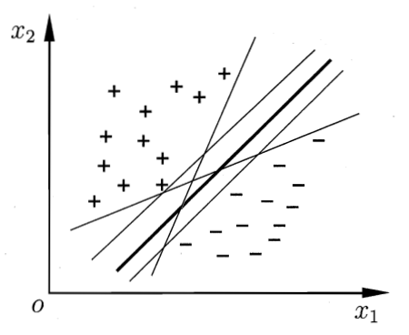
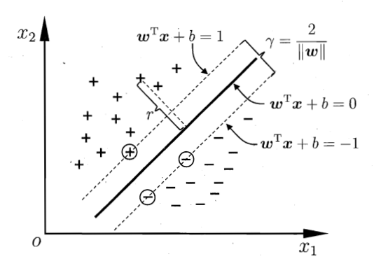
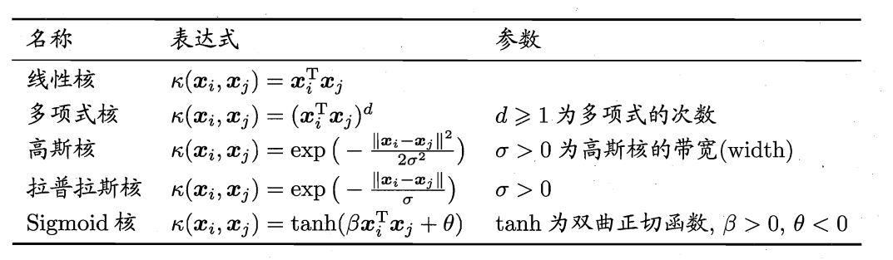
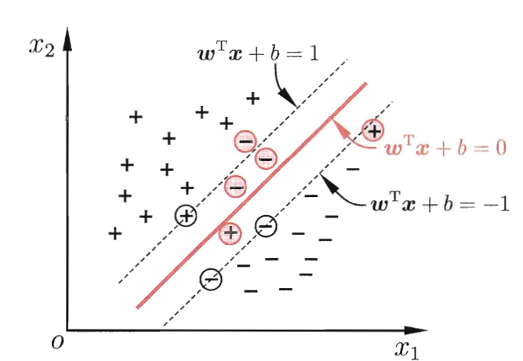
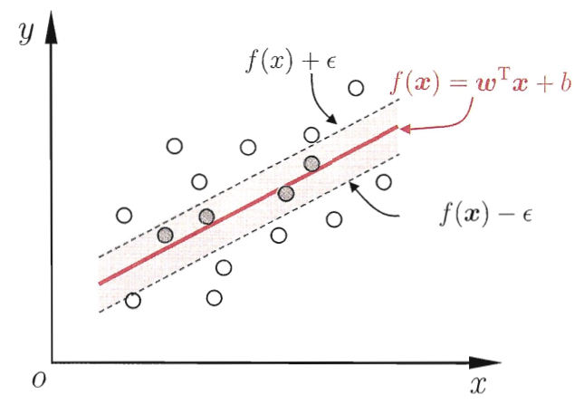

# 1. 支持向量机的基本形式

首先我们通过一个利用==支持向量机（Support Vector Machine）==来进行二分类的例子来了解支持向量机的基本形式，假设在一个二维平面上，有一些离散分布的点，这些点一部分属于正类，一部分属于负类，如下图所示：

我们需要做的是找到一条直线，能够将现有的两类点分开。不难发现，这样的直线可能有很多条，但是我们除了需要能够区分现有的点以外，还需要考虑是否适用于以后出现的新的点，即模型的泛化性能。那么我们如何衡量模型的泛化性能呢，可以通过下面的图进一步考察：

​​

图中的每一个点到直线上都有一定的距离，而在两类点中，有一些点与直线有最近且相等的距离，将这个最近的距离乘 2，就得到了支持向量机的==间隔（margin）==，这些距离直线最近的点就称作==支持向量（support vector）==。间隔越大，说明新加入点时分类的准确率受影响的程度越小，即模型的泛化性能越好。

将上面的这个例子用数学语言进行描述就是给定数据集 $D=\{(\boldsymbol{x}_1,y_1),(\boldsymbol{x}_2,y_2),\ldots,(\boldsymbol{x}_m,y_m)\},y_i\in\{-1,+1\}$，找到一个超平面 $\bm{w}^\mathrm{T}\boldsymbol{x}+b=0$，能够在样本空间中分开两类样本。空间中任意点到超平面的距离为：

$$
r=\frac{|\boldsymbol{w^\mathrm{T}}\boldsymbol{x}+b|}{||\boldsymbol{w}||}
$$

由于对于符合条件的超平面 $(\bm{w}, b)$，将其参数进行仿射变换后的超平面 $(\bm{w'}, b')$ 也是符合条件的，故可进行如下的约定：

$$
\left\{\begin{array}{ll}\boldsymbol{w^\mathrm{T}}\boldsymbol{x_i}+b\geqslant+1,&y_i=+1;\\\boldsymbol{w^\mathrm{T}}\boldsymbol{x_i}+b\leqslant-1,&y_i=-1.\end{array}\right.
$$

所以之前提到的间隔就可以表示为：

$$
\gamma=\frac2{||\boldsymbol{w}||}
$$

我们的目标就是要找到一个超平面 $(\bm{w}, b)$，使得间隔 $\gamma$ 最大，可以由下列式子表示：

$$
\begin{aligned}\max_{\boldsymbol{w},b}\quad&\frac2{||\boldsymbol{w}||}\\\mathrm{s.t.~}\quad&y_i(\boldsymbol{w}^\mathrm{T}\boldsymbol{x}_i+b)\geqslant1,\quad i=1,2,\ldots,m.\end{aligned}
$$

在机器学习中，我们通常将最大化问题转化为最小化问题，即转化为：

$$
\begin{aligned}\min_{\boldsymbol{w},b}\quad&\frac12\|\boldsymbol{w}\|^2\\\mathrm{s.t.}\quad&y_i(\boldsymbol{w}^\mathrm{T}\boldsymbol{x}_i+b)\geqslant1,\quad i=1,2,\ldots,m.\end{aligned}
$$

以上就是支持向量机的基本形式的直观解释与数学形式。

# 2. 对偶形式

支持向量机除了具有基本形式之外，还可以转化为对偶问题进行求解，之所以要转化为对偶问题，是因为在优化问题中，对偶问题往往更好解，且在这里可以自然引入核函数（后面会涉及），但由于笔者还未学习凸优化的相关知识，更深层次的原因在这里无法解答，这里仅列出对偶问题的转化过程以供参考。

我们可以通过拉格朗日乘子法将支持向量机基本形式转化为对偶形式：

$$
L(\boldsymbol{w},b,\boldsymbol{\alpha})=\frac12\left.\|\boldsymbol{w}\|^2+\sum_{i=1}^m\alpha_i\left(1-y_i(\boldsymbol{w}^\mathrm{T}\boldsymbol{x}_i+b)\right)\right.
$$

‍

其中 $L(\bm{w},b,\bm{\alpha})$ 为拉格朗日函数，$\bm{\alpha}$ 为拉格朗日乘子，令其对 $\bm{w},b$ 分别求导得：

$$
\begin{aligned}\boldsymbol{w}&=\sum_{i=1}^m\alpha_iy_i\boldsymbol{x}_i,\\0&=\sum_{i=1}^m\alpha_iy_i.\end{aligned}
$$

再将上述结果带入到拉格朗日函数中就可以得到该问题的对偶形式：

$$
\begin{aligned}\max_{\boldsymbol{\alpha}}&\quad\sum_{i=1}^m\alpha_i-\frac{1}{2}\sum_{i=1}^m\sum_{j=1}^m\alpha_i\alpha_jy_iy_j\boldsymbol{x}_i^\mathrm{T}\boldsymbol{x}_j\\\mathrm{s.t.}&\quad\sum_{i=1}^m\alpha_iy_i=0
\end{aligned}
$$

通过 SMO（Sequential Minimal Optimization）可以对上述问题进行求解，这里不详细推导，感兴趣的读者可以自行阅读相关材料。

# 3. 核函数

在前面我们举的例子中，数据集是线性可分的，这意味着我们总能找到一个超平面对样本空间进行分割。当我们面对数据集线性不可分的情况时，就需要通过==核函数（kernel function）==将样本空间映射到高纬特征空间进行学习。

核函数是一类函数的统称，不同的核函数能够将样本空间映射为不同的特征空间，它必须能够对于任意数据 $D=\{\boldsymbol{x}_1,\boldsymbol{x}_2,\ldots,\boldsymbol{x}_m\}$，其核==矩阵（kenel matrix）==都是半正定的，即

$$
\mathbf{K}=\begin{bmatrix}\kappa(\boldsymbol{x}_1,\boldsymbol{x}_1)&\cdots&\kappa(\boldsymbol{x}_1,\boldsymbol{x}_j)&\cdots&\kappa(\boldsymbol{x}_1,\boldsymbol{x}_m)\\\vdots&\ddots&\vdots&\ddots&\vdots\\\kappa(\boldsymbol{x}_i,\boldsymbol{x}_1)&\cdots&\kappa(\boldsymbol{x}_i,\boldsymbol{x}_j)&\cdots&\kappa(\boldsymbol{x}_i,\boldsymbol{x}_m)\\\vdots&\ddots&\vdots&\ddots&\vdots\\\kappa(\boldsymbol{x}_m,\boldsymbol{x}_1)&\cdots&\kappa(\boldsymbol{x}_m,\boldsymbol{x}_j)&\cdots&\kappa(\boldsymbol{x}_m,\boldsymbol{x}_m)\end{bmatrix}
$$

常见的核函数有：

对于核函数的选择没有特定的方法，主要是依据问题和基本经验而定，通常在未知情况首先采用高斯核。

# 4. 软间隔与正则化

## 4.1 软间隔（soft margin）

在我们前面的举例中，对于一个线性可分的数据集，最终能够找到一个超平面进行分割，进而能够得到间隔 $\gamma$，也被称为==硬间隔（hard margin）==。但我们面对着两个问题，第一是核函数的选取没有定则，很难选择到合适的核函数使得样本在特征空间线性可分；第二是即使能够找到核函数使样本在特征空间线性可分，也不能确定这是否是过拟合的影响。为了解决该问题，人们提出了软间隔的概念，即允许超平面在一些样本上分类错误。

‍

​​

在上面的示意图中，红色的样本就是分类错误的样本，针对这些样本，我们在原有的目标中进行修正，得到软间隔的优化目标：

$$
\min_{\boldsymbol{w},b}\left.\frac12\|\boldsymbol{w}\|^2+C\sum_{i=1}^m\ell_{0/1}\left(y_i\left(\boldsymbol{w}^\mathrm{T}\boldsymbol{x}_i+b\right)-1\right)\right.
$$

其中 $\ell_{0/1}$ 代表 $0/1$ 损失函数，$C$ 是一个常数，再引入松弛变量（slack variable）$\xi_{i}\geqslant0$，可将目标进一步改写为：

$$
\min_{\boldsymbol{w},b,\xi_i}\frac12\|\boldsymbol{w}\|^2+C\sum_{i=1}^m\xi_i
$$

这就是常见的软间隔优化目标形式。

由于 $\ell_{0/1}$ 的数学性质不佳，有三种常见的替代损失函数：

$$
\begin{aligned}
&\mathrm{hinge~}\text{损失: }\ell_{hinge}(z)=\max(0,1-z): \\
&\text{指数损失}(\text{exponential loss}){:}\ell_{exp}(z)=\exp(-z); \\
&\text{对率损失}(\mathrm{logistic~loss}){:}\ell_{log}(z)=\log(1+\exp(-z)).
\end{aligned}
$$

## 4.2 正则化

我们可以将软间隔的优化目标写成更一般的形式：

$$
\min_f\Omega(f)+C\sum_{i=1}^m\ell(f(\boldsymbol{x}_i),y_i)
$$

目标中包含了两项，一项 $\Omega(f)$ 为结构风险，代表模型本身的性质，一项为 $\sum_{i=1}^m\ell(f(\boldsymbol{x}_i),y_i)$ 为经验风险，代表模型在训练集上的损失，$C$ 为正则化常数，而 $\Omega(f)$ 就是我们引入的正则项，它代表了<u>对模型复杂度的惩罚</u>，主要是为了<u>防止过拟合</u>。

# 5. 支持向量机回归

支持向量机除了可以解决分类问题，还可以应用于回归问题，这时我们以超平面为中心，划分一个宽度为 $2\epsilon$ 的分隔带，当样本落入分隔带中时，判断为正确预测，只计算落在分隔带之外的样本造成的损失，其中 $\epsilon$ 为我们对样本预测的容忍程度，下面的图直观地展示了支持向量机回归：

​​

其中两条虚线之间的部分就是分隔带，落入其中的样本点被认为是正确预测的，支持向量机回归（support vector regression）的目标可以表达为：

$$
\min\limits_{\boldsymbol{w},b}\frac{1}{2}\|\boldsymbol{w}\|^2+C\sum\limits_{i=1}^{m}\ell_{\epsilon}\left(f(\boldsymbol{x}_i)-y_i\right)
$$

其中 $\ell_{\epsilon}$ 为 $\epsilon$ 不敏感损失函数（$\epsilon$-insensative function），具体表达式如下：

$$
\ell_\epsilon(z)=\left\{\begin{array}{ll}0,&\text{if}|z|\leqslant\epsilon;\\|z|-\epsilon,&\text{otherwise}.\end{array}\right.
$$

# 6. 核方法

在利用支持向量机处理不具有线性可分性的数据集时，我们通过引入核函数来将样本空间映射到高纬特征空间，使得样本在特征空间线性可分，这样我们就能找到一个超平面对样本进行区分。这种引入核函数将样本空间映射到高纬空间的思想也可应用于其他模型，其核心可以归纳为==表示定理（representor therem）==：令 $\mathbb{H}$ 表示核函数 $\kappa$ 对应的==再生核希尔伯特空间（reproducing kernel Hilbert sapce）==，$\|h\|_{\mathbb{H}}$ 表示 $\mathbb{H}$ 空间中关于 $h$ 的范数，对于任意单调递增函数 $\Omega:[0,\infty]\mapsto\mathbb{R}$ 和任意非负损失函数 $\ell:\mathbb{R}^m\mapsto[0,\infty]$，优化问题

$$
\min\limits_{h\in\mathbb{H}}F(h)=\Omega(\|h\|_{\mathbb{H}})+\ell(h(\boldsymbol{x}_1),h(\boldsymbol{x}_2),\ldots,h(\boldsymbol{x}_m))
$$

的解总可以表示为：

$$
h^*(\boldsymbol{x})=\sum_{i=1}^m\alpha_i\kappa(\boldsymbol{x},\boldsymbol{x}_i)
$$

表示定理意味着对于在样本空间中非线性可分问题，满足一定条件就可以转化为高维特征空间的线性可分问题，这为我们解决相关问题提供了很大的便利。
