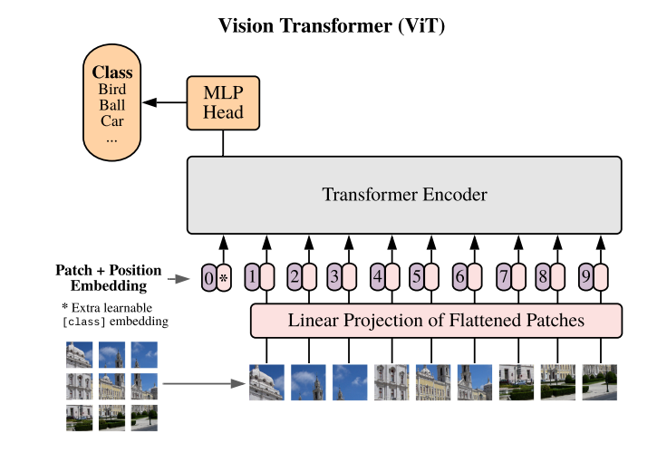
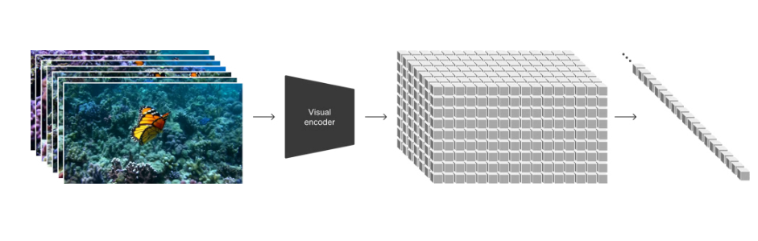
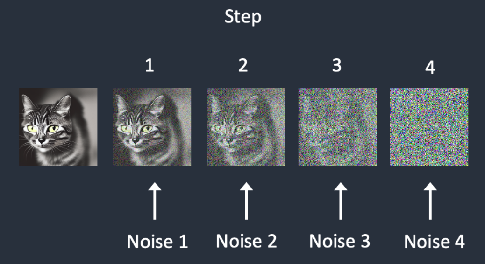
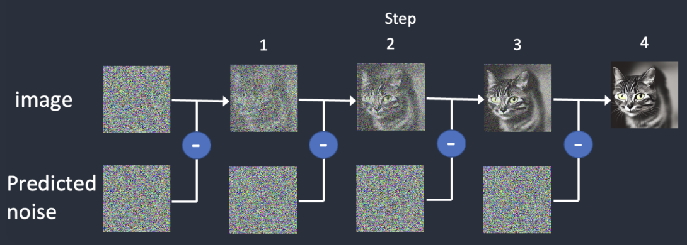
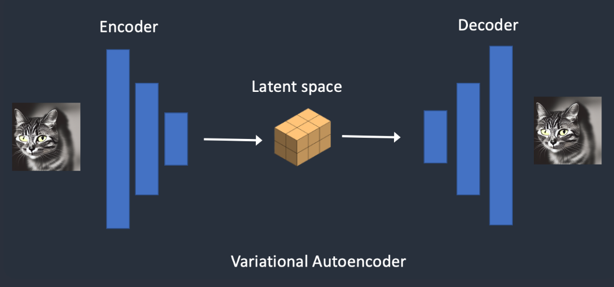

<!-- @import "[TOC]" {cmd="toc" depthFrom=1 depthTo=6 orderedList=false} -->

<!-- code_chunk_output -->

- [Sora 是什么](#sora-是什么)
- [Sora 的能力](#sora-的能力)
- [Sora 相关技术解读](#sora-相关技术解读)
  - [Patch](#patch)
  - [Diffusion Transformer](#diffusion-transformer)
    - [diffusion model](#diffusion-model)
    - [latent diffusion model](#latent-diffusion-model)
    - [DiT](#dit)
  - [dalle3](#dalle3)
  - [SDedit](#sdedit)
- [Sora局限性](#sora局限性)
- [参考资料：](#参考资料)

<!-- /code_chunk_output -->

## Sora 是什么

> Introducing Sora, our text-to-video model. Sora can generate videos up to a minute long while maintaining visual quality and adherence to the user’s prompt.

Sora 主要是一个文生视频模型，简单来讲就是可以根据用户指定的文字 prompt，生成一个长达一分钟的视频。当然 Sora 的能力远不止于此，OpenAI 在技术报告中对 Sora 的各种能力进行了简单介绍。

## Sora 的能力

Sora 除了 text-to-video 之外，还具备以下的一些能力：
- Prompting with images and videos
  - image-to-video：根据图片和 prompt 生成视频
  - extending video：对视频进行扩展，在时间尺度上可以向前扩展或者向后扩展
  - video-to-video：转换视频风格
  - connecting videos：视频场景拼接
- image generation：图片生成
- simulation capabilities
  - 3D consistency：生成的视频中的物体保持在三维空间中的一致性
  - Long-range coherence and object permanence：长时间的前后画面连贯性以及物体持久性
  - Interacting with the world：与真实世界发生互动

不难看出，Sora 的强大能力主要体现在 prompt 的灵活性、能够处理任务的多样性以及对真实世界物理规律有一定理解上。

## Sora 相关技术解读

### Patch

在 NLP 中，token 可以对各种文本进行统一表示，而在 CV 中，patch 也可以作为对各种图像的一种统一表示。比如在 vision transformer 中，就将图像切割为 patch，进而送入到 transformer 架构中进行处理。

就像在 NLP 中可以通过 encoder 对 token 进行嵌入，在 CV 中也可以通过 visual encoder 将 patch 映射到潜空间（latent space）中，对图像信息进行表示。

在 Sora 中，不仅针对空间信息进行分割，同时也考虑到了时序信息，得到 spacetime latent patches。

### Diffusion Transformer

Sora 是一个扩散模型，主要基于 DiT（Scalable Diffusion Models with Transformers），核心是将 stable diffusion 中的 U-Net 结构替换成 transformer 结构。所以我们首先需要了解 diffusion model 以及 latent diffusion models。

#### diffusion model

diffusion model 为什么叫 diffusion？我们需要首先了解 forward diffusion 和 reverse diffusion。 
forward diffusion 简单来说就是一步一步给图像添加噪声，而 reverse diffusion 就是预测噪声，然后用加过噪声的图像减去预测出来的噪声。这个过程就好比有一缸水，在某个位置往水里滴一滴墨，随着墨水的扩散，到最后我们会完全认不出来是在哪个地方滴的墨水。

#### latent diffusion model

如果我们直接在图像上加噪声去噪声，那么训练的参数量会非常大，而将图像首先转化到 latent space 中，最后再转化到 pixel space ，这样参数量就会大大减少。

#### DiT

待更新

### dalle3

待更新

### SDedit

待更新

## Sora局限性

待更新

## 参考资料：
- [Sora技术报告](https://openai.com/research/video-generation-models-as-world-simulators)
- [An Image is Worth 16x16 Words: Transformers for Image Recognition at Scale](https://arxiv.org/abs/2010.11929)
- [Scalable Diffusion Models with Transformers](https://arxiv.org/abs/2212.09748)
- [How does Stable Diffusion work?](https://stable-diffusion-art.com/how-stable-diffusion-work/)
