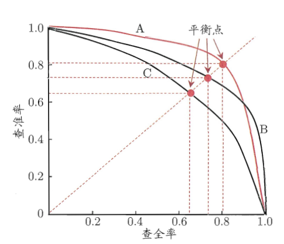
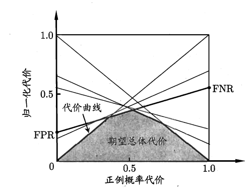

# 第一章、第二章

# 1. 机器学习概述

​​​​

机器学习通过将**学习算法（learning algorithm）**应用于**数据（Data）**上，学习或训练得到**模型（model）**，通过对模型进行**评估（evaluation）和选择（selection）**，调整学习算法，最终确定模型，以较好地解决**学习任务**。

# 2. 数据（Data）

## 2.1 数据集划分

* 训练集（train set）：训练集用于模型训练，一般占所有数据的80%左右。
* 测试集（test set）：测试集用于评估模型的泛化性能，一般占所有数据的20%左右。
* 验证集（valid set）：验证集用于进行模型选择与调参，一般从训练集中划分。

## 2.2 样本与标签

$D$：数据集（Data set），包含 $m$ 个样本（sample）。

$x_i$：数据集中的第 $i$ 个样本，是一个包含 $d$ 个特征（feature）的 $d$ 维特征向量（feature vector）。

$x_{ij}$：样本 $x_i$ 的第 $j$ 个特征的值。

$y$：标签（label）向量，包含 $m$ 个样本对应的标签。

# 3. 学习任务

## 3.1 按预测的结果形式划分

* 分类（classification）
* 回归（regression）
* 聚类（clustering）
* ···

## 3.2 按数据集有无标签划分

* 有监督学习：有标签
* 无监督学习：无标签

# 4. 模型评估与选择

## 4.1 误差与拟合情况

### 4.1.1 误差

* 经验/训练误差（empirical/training error）：模型在**训练集**上的误差
* 测试误差（testing error）：模型在**测试集**上的误差
* 泛化误差（generalization error）：模型在**新样本**上的误差

### 4.1.2 拟合情况

* 过拟合（overfitting）：模型的经验误差小，但泛化误差大
* 欠拟合（underfitting）：模型的经验误差大

​​

## 4.2 评估方法

### 4.2.1 留出法（hold-out）

将数据集划分为互斥的训练集和测试集，划分时要进行**分层采样**，进行**多次随机划分后取平均值**。

### 4.2.2 k折交叉验证法（k-fold cross-validation）

将数据集分为 k 个互斥的小数据集，每次将其中一个作为测试集，其余 k-1 个作为训练集，取 k 次结果的平均。

### 4.2.3 自助法（可重复采样法）（bootstrapping）

对原始数据集 $D$（m条数据）进行有放回采样 m 次，得到新的数据集 $D^{'}$，将 $D^{'}$ 作为训练集，$D/D^{'}$ 作为测试集。

$$
\lim_{m\mapsto\infty}\left(1-\frac1m\right)^m\mapsto\frac1e\approx0.368
$$

$D$ 中有大概 36.8% 的数据不会被采样到。

## 4.3 性能度量

### 4.3.1 回归性能度量

* 均方误差（mean squared error）

  $$
  E(f;D)=\frac{1}{m}\sum_{i=1}^{m}\left(f\left(\boldsymbol{x}_i\right)-y_i\right)^2
  $$

### 4.3.2 分类性能度量

#### 4.3.2.1 错误率（error rate）与准确率（accuracy）

* 错误率

  $$
  E(f;D)=\frac1m\sum_{i=1}^m\mathbb{I}\left(f\left(\boldsymbol{x}_i\right)\neq y_i\right)
  $$
* 准确率

  $$
  \begin{aligned}
  \operatorname{acc}(f;D)& =\quad\frac1m\sum_{i=1}^{m}\mathbb{I}\left(f\left(\boldsymbol{x}_{i}\right)=y_{i}\right)  \\
  &=\quad1-E(f;D)
  \end{aligned}
  $$

#### 4.3.2.2 精确率/查准率（precision），召回率/查全率（recall），f1分数，P-R曲线

对于二分类问题，标签与预测结果可以构成混淆矩阵（confusion matrix）

​​

* 精确率/**查准**率：

  $$
  P=\frac{TP}{TP+FP}=\frac{TP}{Pred\_P}
  $$

* 召回率/**查全**率:

  $$
  R=\frac{TP}{TP+FN}=\frac{TP}{Label\_P}
  $$
* f1分数：精确率和召回率的调和平均数

  $$
  F1=\frac{2}{\frac{1}{p} + \frac{1}{R}}
  $$
* P-R曲线

  ​​

  模型的理想状况是精确率和召回率都较高，所以可以通过比较 P-R 曲线面积或者平衡点所处的位置进行模型的比较。通过**比较 P-R 曲线面积**，模型 B 优于模型 C；通过**比较平衡点所处的位置**，模型 A 优于模型 B。

#### 4.3.2.3 ROC（Reciecer Operating Characteristic）与AUC（Area Under ROC Curve）

* ROC曲线的绘制过程

  通常二分类问题是将模型预测结果是否超过某个**阈值**来将进行正负分类，将**模型预测结果从大到小排列**，从将所有实例都预测为负类开始，**逐渐按照顺序增加预测为正类的个数**，计算此时的真正例率和假正例率，将（假正例率，真正例率）描点在 ROC 图中，最终得到 ROC 曲线。ROC曲线表示了一般情况下模型的泛化能力。

* AUC 计算方法

  * 直接估算

    $$
    \text{AUC}=\frac12\sum_{i=1}^{m-1}(x_{i+1}-x_i)\cdot(y_i+y_{i+1})
    $$
  * 计算空白区域面积

    $$
    \ell_{rank}=\frac{1}{m^+m^-}\sum_{\boldsymbol{x}^+\in D^+}\sum_{\boldsymbol{x}^-\in D^-}\left(\mathbb{I}\left(f(\boldsymbol{x}^+)<f(\boldsymbol{x}^-)\right)+\frac{1}{2}\mathbb{I}\left(f(\boldsymbol{x}^+)=f(\boldsymbol{x}^-)\right)\right)
    $$

    $$
    \mathrm{AUC}=1-\ell_{rank}
    $$

  通过比较 AUC 可以比较模型泛化性能的优劣。

#### 4.3.2.4 代价敏感错误率与代价曲线

在之前的讨论中，都假设错误的代价均等，当出现**非均等代价**时，使用代价曲线可以更好地描述学习算法的**期望总体代价**。

​

其中 $cost_{01}$ 为将 0 类预测为 1 类的代价，$cost_{10}$ 为将 1 类预测为 0 类的代价，它们可能不相等。

计算期望总体代价时就应该采取加权的方式：

$$
\begin{aligned}
E(f;D;cost)=& \frac1m\left(\sum_{\boldsymbol{x}_i\in D^+}\mathbb{I}\left(f\left(\boldsymbol{x}_i\right)\neq y_i\right)\times cost_{01}\right.  \\
&\left.+\sum_{\boldsymbol{x}_{i}\in D^{-}}\mathbb{I}\left(f\left(\boldsymbol{x}_{i}\right)\neq y_{i}\right)\times cost_{10}\right)
\end{aligned}
$$

​

正例概率代价：

$$
P(+)cost=\frac{p\times cost_{01}}{p\times cost_{01}+(1-p)\times cost_{10}}
$$

归一化代价：

$$
cost_{norm}=\frac{\text{FNR}\times p\times cost_{01}+\text{FPR}\times(1-p)\times cost_{10}}{p\times cost_{01}+(1-p)\times cost_{10}}
$$

代价曲线是**将ROC曲线上的每一点转化为线段**，然后**取所有线段的下界包含的面积作为期望总体代价的表征。**

## 4.4 比较检验

### 4.4.1 假设检验

### 4.4.2 交叉验证 t 检验

### 4.4.3 McNemar 检验

### 4.4.2 Friedman 检验与 Nemenyi 后续检验

## 4.5 方差与偏差分解

将模型期望泛化误差进行方差与偏差分解，进而**解释学习算法的泛化性能**。

$$
\begin{aligned}
E(f;D)& =\mathbb{E}_{D}\left[\left(f\left(\boldsymbol{x};D\right)-y_{D}\right)^{2}\right]  \\
&=\mathbb{E}_{D}\left[\left(f\left(\boldsymbol{x};D\right)-\bar{f}\left(\boldsymbol{x}\right)+\bar{f}\left(\boldsymbol{x}\right)-y_{D}\right)^{2}\right] \\
&=\mathbb{E}_{D}\left[\left(f\left(\boldsymbol{x};D\right)-\bar{f}\left(\boldsymbol{x}\right)\right)^{2}\right]+\mathbb{E}_{D}\left[\left(\bar{f}\left(\boldsymbol{x}\right)-y_{D}\right)^{2}\right] \\
&+\operatorname{E}_D\left[2\left(f\left(\boldsymbol{x};D\right)-\bar{f}\left(\boldsymbol{x}\right)\right)\left(\bar{f}\left(\boldsymbol{x}\right)-y_D\right)\right] \\
&=\mathbb{E}_{D}\left[\left(f\left(\boldsymbol{x};D\right)-\bar{f}\left(\boldsymbol{x}\right)\right)^{2}\right]+\mathbb{E}_{D}\left[\left(\bar{f}\left(\boldsymbol{x}\right)-y_{D}\right)^{2}\right] \\
&=\mathbb{E}_{D}\left[\left(f\left(\boldsymbol{x};D\right)-\bar{f}\left(\boldsymbol{x}\right)\right)^{2}\right]+\mathbb{E}_{D}\left[\left(\bar{f}\left(\boldsymbol{x}\right)-y+y-y_{D}\right)^{2}\right] \\
&=\mathbb{E}_{D}\left[\left(f\left(\boldsymbol{x};D\right)-\bar{f}\left(\boldsymbol{x}\right)\right)^{2}\right]+\mathbb{E}_{D}\left[\left(\bar{f}\left(\boldsymbol{x}\right)-y\right)^{2}\right]+\mathbb{E}_{D}\left[\left(y-y_{D}\right)^{2}\right] \\
&+2\mathbb{E}_D\left[\left(\bar{f}\left(\boldsymbol{x}\right)-y\right)\left(y-y_D\right)\right] \\
&=\mathbb{E}_{D}\left[\left(f\left(\boldsymbol{x};D\right)-\bar{f}\left(\boldsymbol{x}\right)\right)^{2}\right]+\left(\bar{f}\left(\boldsymbol{x}\right)-y\right)^{2}+\mathbb{E}_{D}\left[(y_{D}-y)^{2}\right]
\end{aligned}
$$

模型泛化误差 = 偏差 + 方差 + 噪声

$$
E(f;D)=bias^2\left(\boldsymbol{x}\right)+var\left(\boldsymbol{x}\right)+\varepsilon^2
$$

偏差刻画了模型本身的**拟合能力**，方差刻画了模型**受到数据扰动的影响**，噪声刻画了**学习任务本身的难度**，这三者同时影响着模型的泛化能力。

​​

# 5. 学习算法（learning algorithm）

## 5.1 归纳偏好（inductive bias）

### 5.1.1 归纳偏好的定义

在数据上应用学习算法得到模型的过程可以看做是一个从包含很多个预备模型（假设）的**假设空间**中挑选出符合数据的模型，符合条件的模型可能不止一个。所有符合条件的假设组成的集合称为**版本空间**。但要最终确定一个模型，就需要考虑学习算法的归纳偏好。归纳偏好代表了**学习算法认为什么样的假设优于其他假设的倾向性**。

### 5.1.2 归纳偏好的确定

* 奥卡姆剃刀原理（Occam's razor）：多个假设，选尽量简单的。
* 没有免费的午餐定理（NFL）：不考虑问题重要性的区别，所有假设一样简单。

**讨论算法的好坏，要在具体的问题下讨论。**
